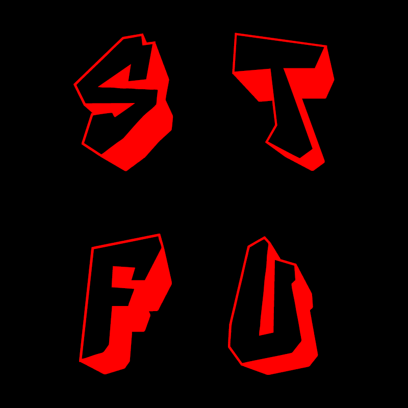

# Stfu bot

<p style="font-size: 16px">
a WIP Discord bot, written in java, that disconnects users when they are too loud.
</p>

# Compiling

<p style="font-size: 16px">
i have no clue.
</p>

# Use

<p style="font-size: 16px">
To use the bot, you need jre 1.8.0_251 or higher. Head over to the releases page, and download the latest release, open your favorite terminal and type:
</p>

```shell
java -jar ./StfuBot_V2.jar <bot token>
```
<p style="font-size: 16px">
To get the bot to join your voice channel and start listening to people and disconnecting them, simply type `stfu!listen` into any channel the bot can see.
</p>

<p style="font-size: 10px">i really need to improve this readme lmao but its like 4 am</p>